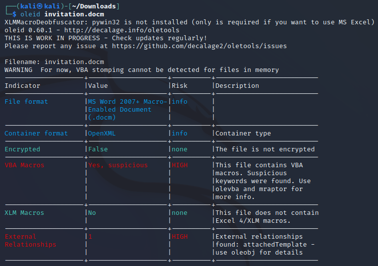
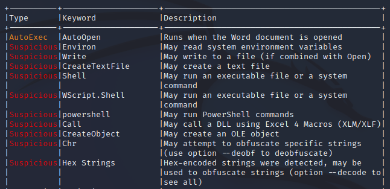

# Halloween Invitation

  
  

## Description

> An email notification pops up. It's from your theater group. Someone decided to throw a party. The invitation looks awesome, but there is something suspicious about this document. Maybe you should take a look before you rent your banana costume.

Provided file is:
- [invitation.docm](forensics_halloween_invitation.zip) **Warning: Windows Defender will flag it as a virus after extracting!**

## Solving process

We get a `.docm` file. I suspect it has hidden macros that can run malicious code, so I started searching for tools that can analyze hidden macros. A great set of tools I used is [oletools](https://github.com/decalage2/oletools). My suspisions were correct, as running `oleid` on the file returns a HIGH risk warning.

For analyzing the macro we can use `olevba`. The macro creates and writes to a file and tries to execute Poweshell commands.

**Flag:** **
