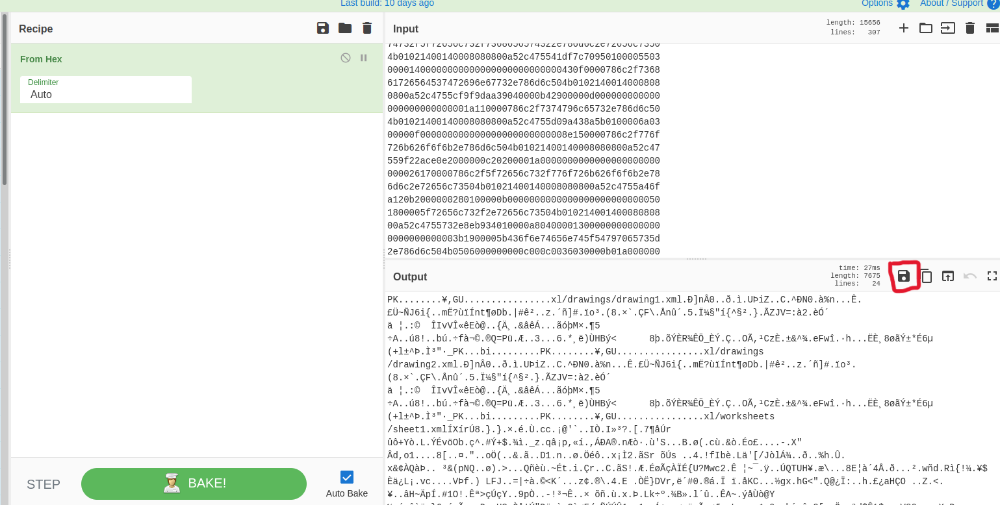
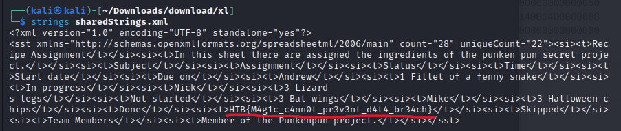

# Trick or Breach

  
  

## Description

> Our company has been working on a secret project for almost a year. None knows about the subject, although rumor is that it is about an old Halloween legend where an old witch in the woods invented a potion to bring pumpkins to life, but in a more up-to-date approach. Unfortunately, we learned that malicious actors accessed our network in a massive cyber attack. Our security team found that the hack had occurred when a group of children came into the office's security external room for trick or treat. One of the children was found to be a paid actor and managed to insert a USB into one of the security personnel's computers, which allowed the hackers to gain access to the company's systems. We only have a network capture during the time of the incident. Can you find out if they stole the secret project?

Provided file is:
- [capture.pcap](capture.pcap)

## Solving process

First things first I opened the file in [Wireshark](https://www.wireshark.org/). We only see DNS traffic inside. But I noticed there is some random HEX data sent with every request. So I started searching for DNS extraction tools. I found a great [article](https://www.netresec.com/?page=Blog&month=2012-06&post=Extracting-DNS-queries) on how to do this with the [tshark tool](https://www.wireshark.org/docs/man-pages/tshark.html) that comes pre installed on [Kali linux](https://www.kali.org/). We use the command:  
    `tshark -r capture.pcap -T fields -e ip.src -e dns.qry.name -Y "dns.flags.response eq 1" > hex.txt`

We now have all DNS requests extracted with some unnecessary information. So we use good old [regex](https://regex101.com/) to extract only the HEX encoded strings.

Get a HEX dump. We throw it into [Cyberchef](https://cyberchef.org). Save the output as a `.zip` file.

Extract the downloaded `.zip` file and get a lot of `.xml` files, that we just search through untill we find our flag.

**Flag:** *HTB{M4g1c_c4nn0t_pr3v3nt_d4t4_br34ch}*
