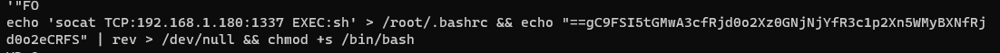
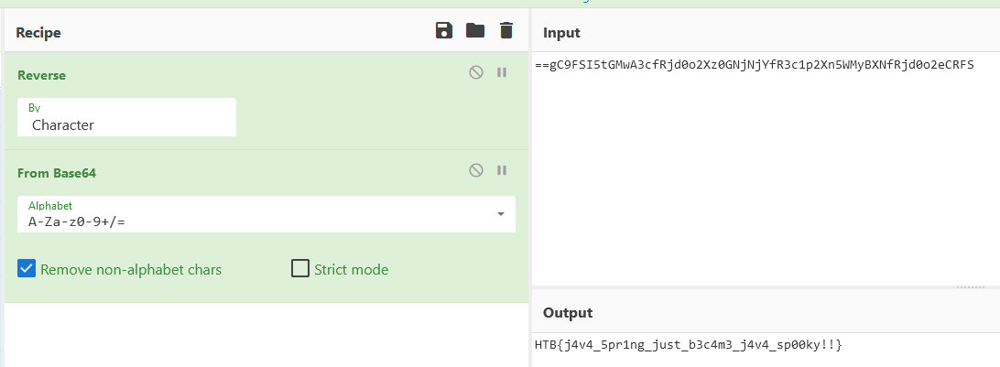

# Wrong Spooky Season - WRITEUP

  
  

## Description

> "I told them it was too soon and in the wrong season to deploy such a website, but they assured me that theming it properly would be enough to stop the ghosts from haunting us. I was wrong." Now there is an internal breach in the `Spooky Network` and you need to find out what happened. Analyze the the network traffic and find how the scary ghosts got in and what they did.

Provided file is:
- [capture.pcap](capture.pcap)

## Solving process

We open the given `.pcap` file in [Wireshark](https://www.wireshark.org/). After looking through we can find some images that were accessed and we can find a hostile command execution that was achieved with RCE. Unable to find the flag in this command execution, I just ran `strings` command on the file. We can see a Base64 encoded string at the end, but it is in reverse order.

Now we just use [Cyberchef](https://cyberchef.org) to decode the message.

**Flag:** *HTB{j4v4_5pr1ng_just_b3c4m3_j4v4_sp00ky!!}*
