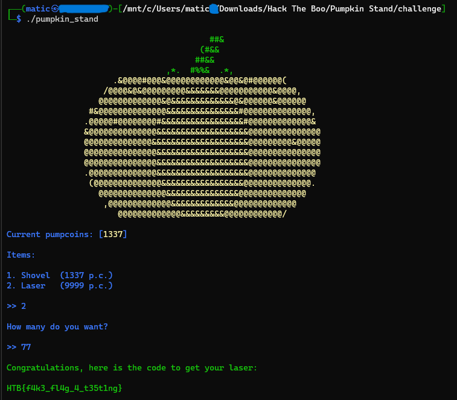

# Pumpkin Stand - WRITEUP

  
  

## Description

> This time of the year, we host our big festival and the one who craves the pumpkin faster and make it as scary as possible, gets an amazing prize! Be fast and try to crave this hard pumpkin!

Provided files are:
- [All files](challenge)

## Solving process

We can run the pumpkin_stand binary file with `./pumpkin_stand`. We are greeted with a pumpkin and a question to choose beetwen a shovel and a laser. We start trying different combinations to see what kind of responses we get. After some lucky guessing we find out that combination `2` and `77`/`777`/`7777` returns us a fake flag that was stored in `flag.txt` file.

Now we just need to do this on a live Docker that we can start from the CTF challenge site to get the correct flag. We connect to the Docker using `netcat`. 

**Flag:** *HTB{1nt3g3R_0v3rfl0w_101_0r_0v3R_9000!}*
