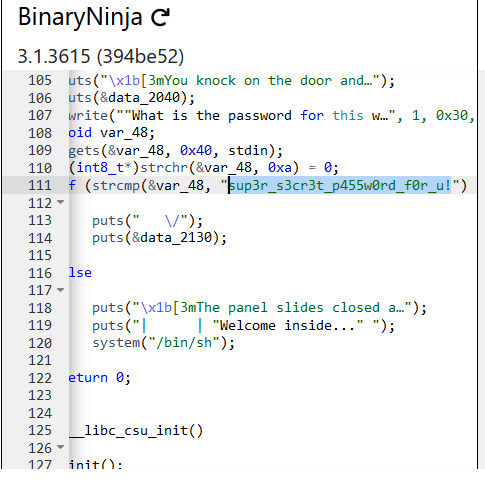
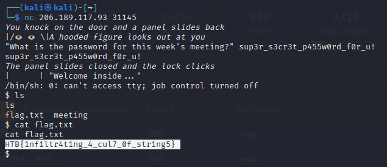

# Cult Meeting

  
  

## Description

> After months of research, you're ready to attempt to infiltrate the meeting of a shadowy cult. Unfortunately, it looks like they've changed their password!

Provided file is:
- [meeting](meeting)

## Solving process

We try to run the file to see what happens. The program asks for a password. We need to find the password. We throw the binary file into an online decompiler tool [DogBolt](https://dogbolt.org), where after looking around we can find the password we need in the *main* function.

We have found our password! Now all we need to do is to start the Docker on the challenge site, connect to it using *netcat* and insert the password. We get a remote shell. We use *ls* and *cat flag.txt* in order to get to our flag.

**Flag:** *HTB{1nf1ltr4t1ng_4_cul7_0f_str1ng5}*
