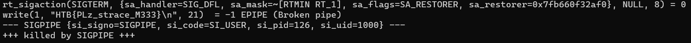

# EncodedPayload

 <br>
 <br>


## Description

> Buried in your basement you've discovered an ancient tome. The pages are full of what look like warnings, but luckily you can't read the language! What will happen if you invoke the ancient spells here?

Provided file is:
- [encodedpayload](encodedpayload)

## Solving process

We get an ELF executable file. We can use command `readelf -a encodedpayload` to read the file. We get an output of:

```
ELF Header:
  Magic:   7f 45 4c 46 01 01 01 00 00 00 00 00 00 00 00 00
  Class:                             ELF32
  Data:                              2's complement, little endian
  Version:                           1 (current)
  OS/ABI:                            UNIX - System V
  ABI Version:                       0
  Type:                              EXEC (Executable file)
  Machine:                           Intel 80386
  Version:                           0x1
  Entry point address:               0x8048054
  Start of program headers:          52 (bytes into file)
  Start of section headers:          0 (bytes into file)
  Flags:                             0x0
  Size of this header:               52 (bytes)
  Size of program headers:           32 (bytes)
  Number of program headers:         1
  Size of section headers:           0 (bytes)
  Number of section headers:         0
  Section header string table index: 0

There are no sections in this file.

There are no section groups in this file.

Program Headers:
  Type           Offset   VirtAddr   PhysAddr   FileSiz MemSiz  Flg Align
  LOAD           0x000000 0x08048000 0x08048000 0x00193 0x002d2 RWE 0x1000

There is no dynamic section in this file.

There are no relocations in this file.
No processor specific unwind information to decode

Dynamic symbol information is not available for displaying symbols.

No version information found in this file.
```

We find it has zero symbols just an ELF header. So we can run `strace ./encodedpayload` on it and find the flag.



**Flag:** *HTB{PLz_strace_M333}*
