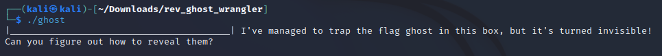

# Ghost Wrangler

 <br>
 <br>


## Description

> Who you gonna call?

Provided file is:
- [ghost](ghost)

## Solving process

We run the binary file first to see what is going on.



Throw the binary file into [DogBolt](https://dogbolt.org). Find our `main` function and a `get_flag` function.

```
int32_t main(int32_t argc, char** argv, char** envp)
{
    printf(&*"[GQh{'f}g wLqjLg{ Lt{#`g&L#uLpgu…"[0x28], get_flag(), 0x28, 0x5f);
    return 0;
}

void* get_flag()
{
    void* rax = malloc(0x29);
    memset(rax, 0, 0x29);
    for (int32_t var_c = 0; var_c <= 0x27; var_c = (var_c + 1))
    {
        *(int8_t*)((char*)rax + ((int64_t)var_c)) = (*"[GQh{'f}g wLqjLg{ Lt{#`g&L#uLpgu…"[((int64_t)var_c)] ^ 0x13);
    }
    return rax;
}
```

We can see that our flag string is XORed with `0x13`. So we write a script that XORs this string back to normal using python.

```python
def main():
    plaintext = "[GQh{'f}g wLqjLg{ Lt{#`g&L#uLpgu&Lc'&g2n"
    flg = []
    for i in range(len(plaintext)):
       flg.append(ord(plaintext[i]) ^ 0x13) 
    print(''.join(chr(i) for i in flg))

main()
```

**Flag:** *HTB{h4unt3d_by_th3_gh0st5_0f_ctf5_p45t!}*
